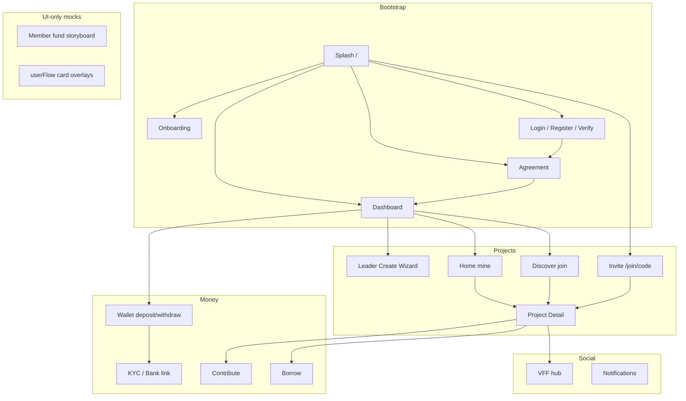
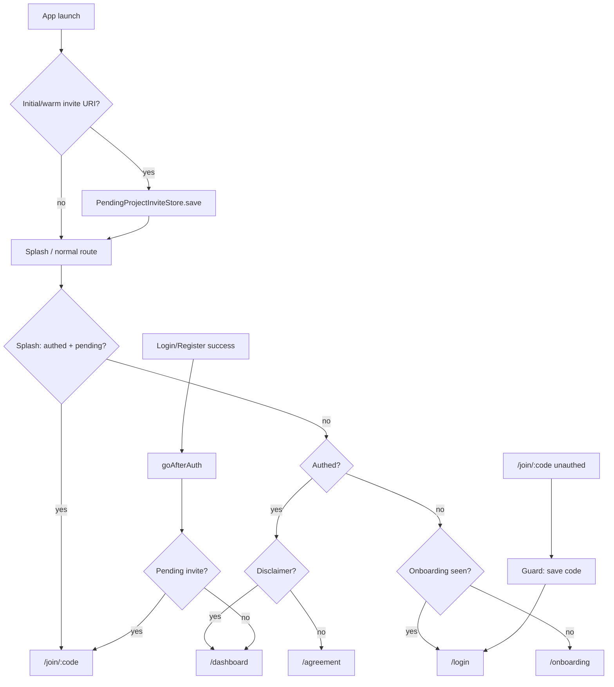

# Vestie — Architecture & Flow Map

Reference for how the Flutter app is structured, how screens connect, and what type each flow is. Use this when adding routes, wiring APIs, or choosing which `lib/` folder to extend.

**Related docs:**

- Vacation / Emergency member UI detail: [`group_vacation_emergency_member_flow.md`](group_vacation_emergency_member_flow.md)
- Route constants: `lib/app/router/app_routes.dart`
- Navigation helpers: `lib/features/project_detail/presentation/navigation/open_project_from_card.dart`

**Last aligned with code:** `lib/app/router/`, `lib/features/`, `lib/user/features/`, `lib/leader/features/`, invite + join success flows.

---

## 1. Code layout (three roles + shared core)

```
lib/
├── app/              → GoRouter, route args, MainApp providers
├── core/             → API, auth session, strings, theme, realtime, deep links
├── features/         → Shared modules (auth, wallet, invites, project_detail shell…)
├── leader/features/  → Owner: create wizard, moderation, voting, borrow approvals
└── user/features/    → Member: home, discover, contribute, borrow, VFF, investment UI
```

| Layer | Who uses it | Typical entry |
|--------|-------------|----------------|
| **Shared `features/`** | Everyone | Splash, auth, dashboard shell, wallet, invites |
| **`leader/features/`** | `viewerRole == GroupLeader` on detail | Dashboard **+** → create wizard |
| **`user/features/`** | Members | Home / Discover cards, contribute, borrow |

### Navigation rules

- Paths live in **`AppRoutes`** — never raw path strings in widgets.
- Screens register in **`app_router.dart`** + **`lib/app/router/route_groups/*`**.
- Many project routes require typed **`GoRouterState.extra`** (`ProjectDetailRouteArgs`, etc.). Wrong or missing extra → “Route not found” scaffold.
- **`CreateProjectCubit`** is provided at **`MainApp`** so the leader wizard survives all pushed steps.

### Post-auth hub: Dashboard

`DashboardScreen` (`/dashboard`) = `IndexedStack` + `NavCubit`:

| Index | Tab | Screen | Primary API |
|-------|-----|--------|-------------|
| 0 | Home | `HomeScreen` | `GET /projects?scope=mine` |
| 1 | Discover | `DiscoverScreen` | `GET /projects?scope=discover` |
| 2 | **+** | Leader create sheet (not a tab page) | `POST /projects` + launch |
| 3 | Wallet | `WalletScreen` | `/wallet`, KYC, bank, Stripe |
| 4 | Profile | `ProfileScreen` | `/users/me`, settings sub-routes |

Header on home/discover: **Notifications** → `/notifications`, **VFF** → `/user/vff`.

---

## 2. Feature folders

### `lib/features/` (shared)

| Folder | Primary flow |
|--------|----------------|
| `auth` | Login, register, verify, forgot/reset password, agreement |
| `splash` | Cold start routing |
| `onboarding` | First-launch carousel |
| `dashboard` | Tab shell |
| `projects` | List models, join, create entities, invite preview |
| `invites` | `/join/:inviteCode` invitation UI |
| `project_detail` | Shared detail entity, bloc, navigation helpers |
| `project_pot` | Pot balance |
| `project_announcements` | Leader announcements |
| `wallet` | Deposit / withdraw |
| `kyc` | Stripe Identity onboarding |
| `bank_accounts` | Linked banks for withdraw |
| `payment_methods` | Cards |
| `stripe` | Config / Connect |
| `profile` | Profile tab + sub-screens |
| `notifications` | In-app list + FCM token |

### `lib/user/features/` (member)

| Folder | Primary flow |
|--------|----------------|
| `home` | My projects tab |
| `discover` | Search, filter, join from catalog |
| `contribute` + `contributions` | Contribute UI + API |
| `borrow` | Borrow request + repay |
| `investment` | Member investment detail / returns |
| `project_detail` | Member-only detail flows (votes, status) |
| `vff` | Vestie Friends & Family hub |
| `create_project_member_fund` | Vacation/emergency **UI storyboard** (no API) |

### `lib/leader/features/` (owner)

| Folder | Primary flow |
|--------|----------------|
| `create_project` | Amount → details → settings → review → success |
| `project_detail` | Join/borrow requests, voting, cancel, distribute funds, penalties |

---

## 3. Project / group types

### Content category

| API / UI | `ProjectCategory` (lists) | `NewProjectCategory` (create) |
|----------|---------------------------|-------------------------------|
| Vacation | `vacations` | `vacation` |
| Emergency | `emergency` | `emergency` |
| Investment | `investment` | `investment` |

API `type` string mapping (substring): `invest*` → investment, `emerg*` → emergency, else → vacation.

### Leader creation flow shape

| `ProjectCreationFlowType` | Set when category is… | Extra wizard step |
|---------------------------|----------------------|-------------------|
| `collaborativeSaving` | Legacy saving path | Saving settings |
| `fundsBorrowing` | Vacation or Emergency | Borrowing settings |
| `investmentOptionalRoi` | Investment | Investment settings (ROI) |
| `streamlined` | Simple path | Shorter chain |

`CreateProjectCubit` maps: vacation/emergency → `fundsBorrowing`; investment → `investmentOptionalRoi`.

### Visibility

| Value | Join behavior |
|-------|----------------|
| **Public** | Often `status: active` → immediate membership |
| **Private** | Often `status: pending` → “Request Sent”; leader approves in join requests |

Invite preview exposes `visibility`, `requiresApproval`, `isJoinable`, `isExpired`.

### Detail routing by category

| Category | Detail route | Member capabilities |
|----------|--------------|---------------------|
| Vacation / Emergency | `/project/detail` | Contribute, borrow (if enabled), success vote; co-leader supported |
| Investment | `/project/investment-detail` | Contribute, returns UI; **no borrow** |

Use `openProjectFromCard` / `openProjectDetailById` with `isInvestment` derived from category or `projectType` string.

---

## 4. Flow taxonomy



| Flow type | Auth? | Data | Entry |
|-----------|-------|------|--------|
| Cold start / session | — | Token + prefs | `/` `SplashCubit` |
| Onboarding | No | Local `OnboardingPrefs` | `/onboarding` |
| Auth | — | `/auth/*`, `/users/me` | `/login`, `/register`, … |
| Risk disclaimer | Yes | `/users/me/risk-disclaimer` | `/agreement` |
| Leader create project | Yes | `POST /projects` + launch | Dashboard **+** → `/create-project/*` |
| Member fund storyboard | Yes | **No API** — `CreateProjectFundDraft` | `/create-project/member-flow/*` |
| Home (my projects) | Yes | `scope=mine` | Tab 0 |
| Discover join | Yes | `scope=discover` + `POST /projects/join` | Tab 1 |
| Invite link join | Yes (guard) | preview + join (`inviteCode` only) | `/join/:code` |
| VFF join | Yes | VFF APIs | `/user/vff/*` |
| Project detail (live) | Yes | `GET /projects/{id}` | Cards, success screens |
| Contribute | Yes | `/contributions/*` | `/project/contribute` |
| Borrow | Yes | borrow-requests APIs | `/project/borrow` (vacation/emergency) |
| Leader moderation | Yes (leader role) | join/borrow/vote APIs | Leader routes from detail |
| Wallet | Yes | `/wallet`, Stripe, KYC, bank | Tab 3 |
| KYC / bank return | Yes | Browser + `app_links` | `vestie://kyc/*`, `vestie://bank/*` (not GoRouter) |
| VFF social | Yes | `/users/me/vffs`, inbox | `/user/vff` |
| Member UI mocks | Yes | `userFlow` on `Project` | Home card → status/vote screens |

---

## 5. Bootstrap & auth

```
/ (Splash)
  ├─ pending invite + authenticated → /join/:code
  ├─ authenticated + disclaimer OK → /dashboard
  ├─ authenticated + no disclaimer → /agreement
  ├─ not authed + onboarding done → /login
  └─ first launch → /onboarding → /login

/login or /register → /verify → ProjectInviteNavigation.goAfterAuth
  ├─ disclaimer not accepted → /agreement (pending invite preserved)
  ├─ disclaimer accepted + pending invite → consume → /join/:code
  └─ disclaimer accepted, no pending → /dashboard
```

**Global GoRouter redirect:** only **`ProjectInviteRouteGuard`** (invite paths). Unauthenticated `/join/:code` → persist code → `/login`. Authenticated without disclaimer → `/agreement` (code **not** consumed). There is **no** blanket auth guard on all routes.

`AppAuthSession` is `refreshListenable` on the router so login/logout re-runs invite redirect.

---

## 6. Join flows (three paths)

All use `POST /projects/join` via `JoinProjectUseCase`. Body must send **exactly one** of `projectId` or `inviteCode` (`join_project_request_body.dart`).

| Source | Body | Success UX |
|--------|------|------------|
| **Discover / Home** | `projectId` only | Public + active → **detail** (`openProjectDetailAfterJoinSuccess`). Private pending → **Request Sent** (`openProjectJoinRequestSentSuccess`, `fromInviteLink: false`) |
| **Invite screen** | `inviteCode` only | Public → **Project Joined** success → Open Project → detail. Private pending → **Request Sent** → **Done → dashboard** (`fromInviteLink: true`) |
| **VFF** | VFF-specific then join | Profile / hub rows |

### Invite deep links

| URI | Handler |
|-----|---------|
| `https://…/join/{code}` | `ProjectInviteDeepLinkService` |
| `vestie://join/{code}` | Same |
| Staging Azure `/join/{code}` | `ApiConstants.inviteShareLinkBase` |

- Cold start: `main()` → `captureInitialInviteIfAny()` → code saved for splash.
- Warm: `uriLinkStream` → if authed `go(/join/{code})`, else `go(/login)`.
- **Excluded from invite parser:** `vestie://kyc/*`, `vestie://bank/*`, Stripe redirect.
- Android: `flutter_deeplinking_enabled=false` — app handles links manually.

Canonical in-app path: **`/join/:inviteCode`** → `ProjectInvitationScreen`.

---

## 7. Leader create project (API)

```
+ tab → amount sheet/screen
  → /create-project/details
  → branch by ProjectCreationFlowType:
       /create-project/saving-settings
       /create-project/funds-borrowing
       /create-project/investment-settings
  → /create-project/review
  → POST /projects + POST /projects/{id}/launch
  → /create-project/success
  → go(/dashboard) + post-frame push detail (reload home)
```

Entry helpers: `lib/leader/features/create_project/presentation/create_project_flow.dart`.

---

## 8. Member vacation / emergency — two tracks

| Track | Purpose | Server? |
|-------|---------|---------|
| **A. Member fund storyboard** | Design walkthrough | **No** — `CreateProjectFundDraft` via `extra` |
| **B. Joined project detail** | Contribute, borrow, votes | **Yes** — `GET /projects/{id}` |

Track A routes: `/create-project/member-flow/*` (see `create_project_member_flow_routes.dart`). Finishing A does **not** create a project.

Track B: home/discover/invite → detail → contribute / borrow / vote flows. Full screen list: [`group_vacation_emergency_member_flow.md`](group_vacation_emergency_member_flow.md).

---

## 9. Investment flows

| Role | Key routes |
|------|------------|
| Member | `/project/investment-detail`, `/user/investment/project-detail`, `/user/investment/my-returns`, `/user/investment/funds-history` |
| Leader | `/project/investment/distribute-funds`, `/project/investment/distribution`, `/project/investment/distribution-success` |

---

## 10. Wallet & compliance

```
/dashboard → Wallet tab
  → /wallet/transaction-amount
  → /wallet/withdraw-method → /wallet/select-bank-account
  → /wallet/select-payment-method (deposit)
  → /wallet/transaction-confirmation → /wallet/transaction-success
  → /wallet/recent-activity

Gates: /kyc/onboarding, /bank/link-onboarding
Returns: app_links (vestie://kyc/complete, vestie://bank/return, HTTPS on API host)
```

Profile: `/profile/edit`, `/profile/payment-methods`, `/profile/my-accounts`, `/profile/transaction-history`, `/profile/completed-projects` (→ vote outcome via `openCompletedProjectView`).

---

## 11. VFF flow

```
/user/vff                    UserVffHubScreen
/user/vff/requests-all       incoming VFF requests
/user/vff/group-invites-all  group invitations
/user/vff/profile            UserVffProfileScreen (extra: user id)
/user/vff/invite-success     after send invite
```

Project detail can open invite-members sheet and VFF requests. APIs under `/users/me/vffs`, inbox, project member VFF endpoints.

---

## 12. Route groups (quick index)

| File | Covers |
|------|--------|
| `core_routes.dart` | Splash, auth, onboarding, dashboard, notifications, create-project leader wizard, invite |
| `profile_wallet_routes.dart` | Profile, wallet, KYC, bank |
| `create_project_member_flow_routes.dart` | Member storyboard (UI only) |
| `project_routes.dart` | Detail, contribute, borrow, leader moderation, join success, votes |
| `user_vff_routes.dart` | VFF hub and sub-screens |

---

## 13. Navigation patterns

| Pattern | When |
|---------|------|
| `context.go` | Replace stack: splash, auth, invite success, dashboard reload |
| `context.push` | Detail, contribute, leader sub-screens |
| `DashboardShellArgs` | Reload lists; `initialTabIndex`; `navigationMark` |
| `openProjectFromCard` | Home/Discover — checks `userFlow` mocks first |
| `popProjectDetailNavigation` | Back from detail → pop or `go(dashboard)` + reload |
| `ProjectInviteNavigation.goAfterAuth` | Login/register/agreement + pending invite |

Central file: `open_project_from_card.dart` — also defines `openProjectJoinedSuccess`, `openProjectJoinRequestSentSuccess`, `openProjectDetailAfterJoinSuccess`, `openProjectDetailAfterCreateSuccess`.

---

## 14. API-backed vs UI-only

| UI-only / partial mock | Live API |
|------------------------|----------|
| Member fund storyboard | Leader create, join, invite preview |
| Some `userFlow` card shortcuts (hardcoded vote UI) | Home/Discover lists, `ProjectDetailBloc` |
| Parts of `UserInvestmentUiSnapshot` | Contribute, borrow, wallet, VFF core |

Check route file comments (“pure UI — no APIs”) before wiring new endpoints.

---

## 15. Realtime & side channels

| Hub | Path | Used for |
|-----|------|----------|
| Projects SignalR | `/hubs/projects` | Project channel join on dashboard |
| Wallet SignalR | `/hubs/wallet` | Wallet balance updates |
| FCM | device token API | Push; deep navigation to screens TBD |

---

## 16. Checklist for new work

1. **Role?** Leader → `lib/leader/features/`. Member-only → `lib/user/features/`. Shared → `lib/features/`.
2. **Category?** Vacation/emergency (borrow + votes) vs investment (distribution, no borrow).
3. **Visibility?** Join `status` → `ProjectJoinSuccessKind` on `/project/joined-success`.
4. **Join path?** Never send both `projectId` and `inviteCode` on join (400).
5. **New route?** `AppRoutes` + route group + `route_args/` + one navigation helper.
6. **Deep link?** Only `/join` uses invite guard; KYC/bank use dedicated `app_links` listeners.

---

## 17. Known gaps

| Item | Notes |
|------|--------|
| `AppRoutes.cardDetail` | Defined in `app_routes.dart` but **not** registered in GoRouter |
| Splash | Routes as soon as auth/onboarding checks finish (`SplashCubit`) |
| Discover public join | Skips shared success screen; opens detail directly |
| Invite public join | Uses `ProjectJoinedSuccessScreen` then Open Project |
| FCM → screen | Token registered; named-route deep navigation incomplete |

---

## 18. Mermaid — invite + auth


