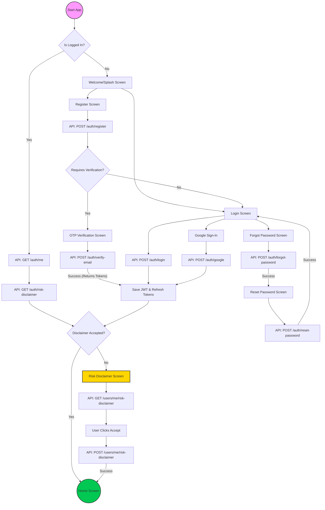

# Vestie Authentication Flow

This document describes the complete authentication and authorization lifecycle for the Vestie Flutter application, including registration, social logins, email verification, and risk disclaimer management.

## Flow Diagram

## Step-by-Step Technical Breakdown

### 1. Registration & Verification
1.  **Registration**: User submits the form. The backend creates a user record but marks them as unverified.
2.  **OTP**: A 6-digit code is sent to the user's email.
3.  **Auto-Login**: Upon successful `verify-email` call, the backend returns the full user object along with Access and Refresh tokens. The app saves these and bypasses the manual login screen.

### 2. Session Restoration (Splash Screen)
When the app starts, the `SplashCubit` performs the following:
1.  **Authentication Check**: Verifies if tokens exist in secure storage.
2.  **Disclaimer Verification**: If authenticated, it calls `GET /auth/risk-disclaimer` to verify the user's acceptance status for the current version.
3.  **Routing**:
    -   If not authenticated -> `OnboardingScreen`.
    -   If authenticated AND accepted -> `DashboardScreen`.
    -   If authenticated BUT NOT accepted -> `AgreementScreen`.

### 3. Login & Session Management
-   **Standard Login**: Uses email/password. Returns tokens and user profile.
-   **Social Login (Google)**: 
    -   The app authenticates with Google Play Services.
    -   An `idToken` is retrieved and sent to the Vestie backend.
    -   The backend validates the token and either creates a new user or logs in an existing one.
-   **Post-Login Check**: Immediately after any login success, the app fetches the disclaimer status to decide between routing to Home or Agreement.

### 4. Risk Disclaimer (Legal Compliance)
The system enforces that no user can access the Home/Dashboard without accepting the latest risk disclaimer.
-   The status is checked both on app startup (Splash) and immediately after login/token-save.
-   If `isAccepted` is false, the user is locked into the `DisclaimerScreen`.
-   Acceptance is tied to a specific `version`. If the legal team updates the disclaimer version, all users will be redirected back to accept the new version.

### 5. Password Recovery
-   The "Forgot Password" flow triggers an email with a 6-digit code (similar to OTP).
-   The "Reset Password" screen requires this code, the user's email, and the new password to complete the process.
