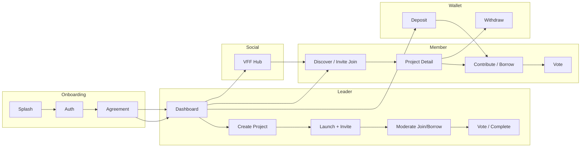

# Vestie — Project Scope & Product Overview

**Document type:** Product & technical scope reference  
**App name:** Vestie (`lib/core/constants/app_strings.dart` → `AppStrings.appName`)  
**Platform:** Flutter mobile (Android & iOS)  
**Category:** Collaborative group savings / fintech  
**Last aligned with codebase:** June 2026

---

## 1. What is Vestie?

**Vestie is a collaborative group savings mobile application.** It helps people **create, join, and manage shared financial goals** with friends, family, or community members — organized as **projects** (also called groups or pots).

Users can:

- **Start a savings project** (as a leader) for vacations, emergencies, or investments
- **Discover and join** public or private projects
- **Contribute money** from a personal Vestie wallet into a group pot
- **Borrow** from the group pot (vacation & emergency projects, when enabled by the leader)
- **Invite others** via shareable links and manage **VFF** (Vestie Friends & Family) connections
- **Deposit, withdraw, and manage** payment methods through **Stripe**-backed flows
- **Vote** on project outcomes (e.g. marking a vacation/emergency project successful)

Vestie is **not a bank**. The app surfaces clear risk disclaimers: funds are not guaranteed, repayment terms are set by group leaders, and Vestie does not arbitrate member disputes.

---

## 2. Problem & value proposition

| Problem | How Vestie addresses it |
|---------|-------------------------|
| Informal group savings (trips, emergencies) is hard to track | Central **project pot**, member list, contribution history, announcements |
| Trust in who joined the group | **VFF** social graph, invite links, join approval for private groups |
| Scattered payments | Single **wallet** with deposit/withdraw and in-app **contribute** to projects |
| Leader overhead | Leader tools: join requests, borrow approvals, voting, fund distribution (investment) |
| Compliance for real money | **KYC**, linked **bank accounts**, **Stripe** cards & PaymentSheet |

---

## 3. Target users & roles

### 3.1 Primary personas

| Persona | Description |
|---------|-------------|
| **Group Leader** | Creates the project, sets rules (borrowing, ROI, visibility), moderates members, starts votes, approves join/borrow requests |
| **Co-Leader** | Delegated helper on **Vacation** and **Emergency** projects only — shares much of the leader detail UI but with a reduced action set |
| **Member** | Joins projects, contributes, may borrow (if enabled), votes on success, uses VFF and wallet |
| **Invited guest** | Opens `/join/{inviteCode}` deep link → preview → join or request access |

### 3.2 Role model (API / UI)

| Role | API `viewerRole` | Typical capabilities |
|------|------------------|----------------------|
| **Group Leader** | `GroupLeader` | Full create + moderation + settings |
| **Co-Leader** | `CoLeader` | Moderation subset on vacation/emergency |
| **Member** | `Member` | Contribute, borrow (if enabled), vote, leave |

Co-leader is **not** supported on **Investment** projects (`ProjectCategory.supportsCoLeader`).

---

## 4. Core domain concepts

### 4.1 Project (group)

A **project** is the central entity. It has:

- **Category:** Vacation, Emergency, or Investment
- **Goal amount** and **current pot** (raised total)
- **Visibility:** Public (instant join) or Private (leader approval)
- **Lifecycle:** Ongoing → completed / cancelled / voting states
- **Members** with roles (leader, co-leader, member)
- Optional **borrowing** rules (vacation/emergency)
- Optional **ROI** (investment)

### 4.2 Wallet

Each user has a **Vestie wallet** used to:

- Hold balance for contributions
- Receive deposits (Stripe PaymentSheet)
- Withdraw to linked bank accounts (after KYC)
- Track recent activity and transaction history

Money flows use **idempotency keys** on contribute, deposit, and withdraw APIs.

### 4.3 VFF (Vestie Friends & Family)

A **social trust layer** inside the app:

- Send / accept / decline **connection requests**
- See **group invitations** and **project-related** inbox items
- Open **connected profiles** and manage connections
- Hub at `/user/vff` with tabs: My VFFs, Requests

VFF is integrated with project invites and member discovery.

### 4.4 Pot & contributions

- **Project pot** = pooled funds raised by members
- **Contribute flow** debits the user wallet (or prompts deposit if balance is short)
- **SignalR** (`/hubs/projects`) can refresh pot/contribution state in real time on project detail

### 4.5 Borrowing (Vacation & Emergency only)

When the leader enables borrowing:

- Members request borrows from the group pot
- Leader approves or rejects requests
- Repayment and penalty rules are configured at project creation
- Member **vote** flows can apply when marking projects successful

Investment projects **do not** expose borrow actions.

---

## 5. Project types (scope by category)

| Category | User goal | Leader wizard branch | Member features | Co-leader |
|----------|-----------|----------------------|-----------------|-----------|
| **Vacation** | Save for a trip | Funds borrowing settings | Contribute, borrow, success vote | Yes |
| **Emergency** | Emergency fund pool | Funds borrowing settings | Contribute, borrow, success vote | Yes |
| **Investment** | Group investment with optional ROI | Investment settings (ROI) | Contribute, returns UI, fund distribution (leader) | No |

### Creation flow types (`ProjectCreationFlowType`)

| Flow | When used |
|------|-----------|
| `fundsBorrowing` | Vacation or Emergency |
| `investmentOptionalRoi` | Investment |
| `collaborativeSaving` | Legacy saving path |
| `streamlined` | Shorter wizard (details → review) |

---

## 6. Application scope — feature modules

### 6.1 Authentication & onboarding

| Feature | Scope |
|---------|--------|
| Splash & session restore | Token in secure storage, route to dashboard or auth |
| Onboarding carousel | First-launch only (local prefs) |
| Register / login / verify email | Email + password; Google Sign-In |
| Forgot / reset password | Full flow with success screen |
| Risk disclaimer / agreement | Required before dashboard; API-backed acceptance |
| Deep link on cold start | Pending project invite preserved through auth |

**Routes:** `/`, `/onboarding`, `/login`, `/register`, `/verify`, `/agreement`, etc.

---

### 6.2 Dashboard (post-auth hub)

Five-tab shell (`IndexedStack`):

| Tab | Screen | Purpose |
|-----|--------|---------|
| **Home** | My projects + joined projects | Lists from `GET /projects?scope=mine` |
| **Discover** | Search & filter | `GET /projects?scope=discover`, join from catalog |
| **+ (Add)** | Create project entry | Opens leader wizard (not a tab page) |
| **Wallet** | Balance, deposit, withdraw | `/wallet`, Stripe, KYC, bank |
| **Profile** | Account & settings | Edit profile, payment methods, history, guidelines |

Header actions on Home/Discover: **Notifications**, **VFF hub**.

---

### 6.3 Leader — create project wizard

**Owner:** `lib/leader/features/create_project/`

| Step | Content |
|------|---------|
| Amount | Target goal via numpad |
| Details | Name, description, category, deadline, public/private |
| Settings | Branch: saving / borrowing / investment ROI |
| Review | Editable summary |
| Success | Share invite, go to home/detail |

**API:** `POST /projects` + `POST /projects/{id}/launch`

State: `CreateProjectCubit` at app root survives all wizard pushes.

---

### 6.4 Join & invites

Three join paths (all use `POST /projects/join` with **either** `projectId` **or** `inviteCode`):

| Source | UX |
|--------|-----|
| **Discover / Home** | Public → detail; Private pending → “Request Sent” |
| **Invite link** `/join/:code` | Preview screen → join → success → open project |
| **VFF** | Social context then project actions |

**Deep links:** HTTPS and `vestie://join/{code}` via `ProjectInviteDeepLinkService`.

---

### 6.5 Project detail (live API)

**Shared shell:** `lib/features/project_detail/`  
**Leader actions:** `lib/leader/features/project_detail/`  
**Member flows:** `lib/user/features/project_detail/`

| Area | Scope |
|------|--------|
| Project info | Name, category, pot, members preview, announcements |
| Contribute | Amount → confirm → wallet/card → success |
| Borrow | Request → leader approval → repay flow |
| Members | List, member detail, assign/remove co-leader, penalties |
| Join requests | Leader approves private join requests |
| Borrow requests | Leader approves/rejects |
| Voting | Leader starts success vote; members vote; outcomes |
| Investment | Separate detail route, returns, leader fund distribution |
| Leave project | Warning + confirmation |

**Routes:** `/project/detail`, `/project/investment-detail`, `/project/contribute`, `/project/borrow`, leader settings, etc.

---

### 6.6 Wallet & payments (production money flows)

| Feature | Integration |
|---------|-------------|
| Wallet overview | `GET /wallet`, balance, borrowed, locked, pending withdrawal |
| Deposit | Stripe PaymentSheet, payment method picker |
| Withdraw | Bank account, KYC gate, instant/standard options |
| Payment methods | List, add card (SetupIntent), primary card |
| Bank accounts | Link via browser onboarding, Stripe Connect |
| KYC | Stripe Identity browser flow, `app_links` return URLs |
| Transaction history | Profile sub-route with filters |

**Compliance:** `RiskDisclaimerGate` before wallet, contribute, deposit, withdraw, KYC.

---

### 6.7 VFF module

**Owner:** `lib/user/features/vff/`

| Screen / area | Purpose |
|---------------|---------|
| VFF Hub | My connections, incoming requests, group invites |
| Full request lists | See-all scaffolds for inbox |
| VFF Profile | Connected peer profile, metrics, projects |
| Invite success | In-app “invites sent” terminal (not deep link) |

**APIs:** `/users/me/vffs`, inbox, connection accept/decline, project invite actions.

---

### 6.8 Notifications

- In-app notification list with pagination
- Unread badge on dashboard header
- **FCM** push registration after login
- Foreground local notifications

---

### 6.9 Profile & account

| Feature | Scope |
|---------|--------|
| View / edit profile | Photo, name, email |
| Payment methods & cards | CRUD via Stripe |
| My accounts (banks) | Withdraw destinations |
| Transaction history | Wallet movements |
| Completed projects | Historical projects → vote outcome navigation |
| User guidelines | Static risk copy |
| Logout | Clears caches (wallet, payments, Stripe, KYC, bank, FCM) |
| Delete account | Confirmation dialog + API |

---

### 6.10 UI-only / storyboard scope (not live API)

These exist for **design alignment and future wiring** — they do **not** create server projects today:

| Module | Routes | Notes |
|--------|--------|-------|
| **Member fund storyboard** | `/create-project/member-flow/*` | Vacation/emergency walkthrough with `CreateProjectFundDraft` |
| **Some investment member UI** | `/user/investment/*` | Partially mock snapshots |
| **Some `userFlow` card shortcuts** | From home cards | Dev/preview vote overlays |

See `DOCS/group_vacation_emergency_member_flow.md` for member UI track A vs B.

---

## 7. End-to-end user journeys (summary)



---

## 8. Technical scope

### 8.1 Stack

| Layer | Technology |
|-------|------------|
| Framework | Flutter 3.x, Dart 3.11+ |
| State | `flutter_bloc` / Cubit |
| Navigation | `go_router`, `AppRoutes` constants |
| HTTP | Dio + interceptors, Bearer auth |
| Storage | `flutter_secure_storage` (tokens), `shared_preferences` |
| Payments | `flutter_stripe` (PaymentSheet, SetupIntent) |
| Push | Firebase Cloud Messaging + local notifications |
| Realtime | SignalR (`signalr_netcore`) — projects & wallet hubs |
| Deep links | `app_links`, invite parser, KYC/bank return URLs |
| UI | `flutter_screenutil` (390×844), `google_fonts` (Lato), `flutter_svg` |

### 8.2 Architecture

Clean-ish **feature-first** layout:

```
lib/
├── app/           → MainApp, GoRouter, route args
├── core/          → API, auth, theme, DI, shared widgets
├── features/      → Cross-role modules (auth, wallet, invites, detail shell)
├── leader/        → Leader-only flows
└── user/          → Member flows (home, discover, VFF, contribute, borrow)
```

**Rules:** No hardcoded strings/colors/routes in widgets; validation in `ValidationUtils`; product UI via `AppText`, `AppButton`, `AppTextField`.

### 8.3 Backend integration

| Item | Detail |
|------|--------|
| Base API | `ApiConstants.baseUrl` (REST `/api/v1`) |
| Auth | JWT Bearer on protected routes |
| Idempotency | Contribute, deposit intent, withdraw |
| Error UX | `FailureMapper` + `AppSnackBar`, retry on wallet/notifications |
| Production review | `DOCS/qa/production_readiness_review.md` — Weeks 4, 5, 7 marked **Go** |

### 8.4 Realtime & push

| Channel | Purpose |
|---------|---------|
| Projects hub | Join project channel on dashboard; pot/contribution updates |
| Wallet hub | Balance refresh after deposit/withdraw/contribute |
| FCM | Device token registration; foreground notification display |

---

## 9. Platform & non-functional scope

| Area | Scope |
|------|--------|
| **Orientation** | Portrait only |
| **Permissions** | Camera, photo library (profile), notifications |
| **Security** | Secure token storage; debug logs gated in release |
| **Performance** | Production optimization branch: lazy lists, rebuild scoping, image cache |
| **Release** | App Bundle + split-per-abi APK script (`scripts/build_release.ps1`) |
| **Testing** | Unit, widget, integration tests (`test/`, 112+ cases) |
| **QA** | Manual runbooks under `DOCS/qa/` |

---

## 10. Explicit out-of-scope / known gaps

| Item | Status |
|------|--------|
| Vestie as regulated bank / guaranteed returns | Out of scope — disclaimers state otherwise |
| Dispute resolution between members | Out of scope — leader-set rules |
| Web app | Mobile Flutter only |
| Member fund storyboard → live project creation | Not wired — UI walkthrough only |
| FCM tap → specific screen routing | Token registered; deep navigation incomplete |
| `AppRoutes.cardDetail` | Constant exists; not registered in GoRouter |
| Production Android signing | Still debug keystore in Gradle — pre-store task |

---

## 11. Documentation map

| Document | Contents |
|----------|----------|
| [`README.md`](../README.md) | Quick start, stack, screen map |
| [`architecture_flows.md`](architecture_flows.md) | Routes, roles, join paths, API vs mock |
| [`group_vacation_emergency_member_flow.md`](group_vacation_emergency_member_flow.md) | Member vacation/emergency UI detail |
| [`qa/production_readiness_review.md`](qa/production_readiness_review.md) | API integration readiness |
| [`optimization/phase11_final_report.md`](optimization/phase11_final_report.md) | Performance & release hardening |
| **This file** | Product scope and module boundaries |

---

## 12. One-paragraph elevator pitch

**Vestie** is a mobile fintech app for **group savings**: leaders create vacation, emergency, or investment projects; members join via discover or invite links, contribute from a shared wallet, and participate in borrowing and voting where enabled. Leaders moderate membership and money requests; the platform handles **Stripe** payments, **KYC**, and **bank payouts**, while **VFF** builds trust between users. The Flutter codebase follows clean feature architecture with live API integration on core money and project flows, plus selected UI storyboards for future member-fund experiences.
