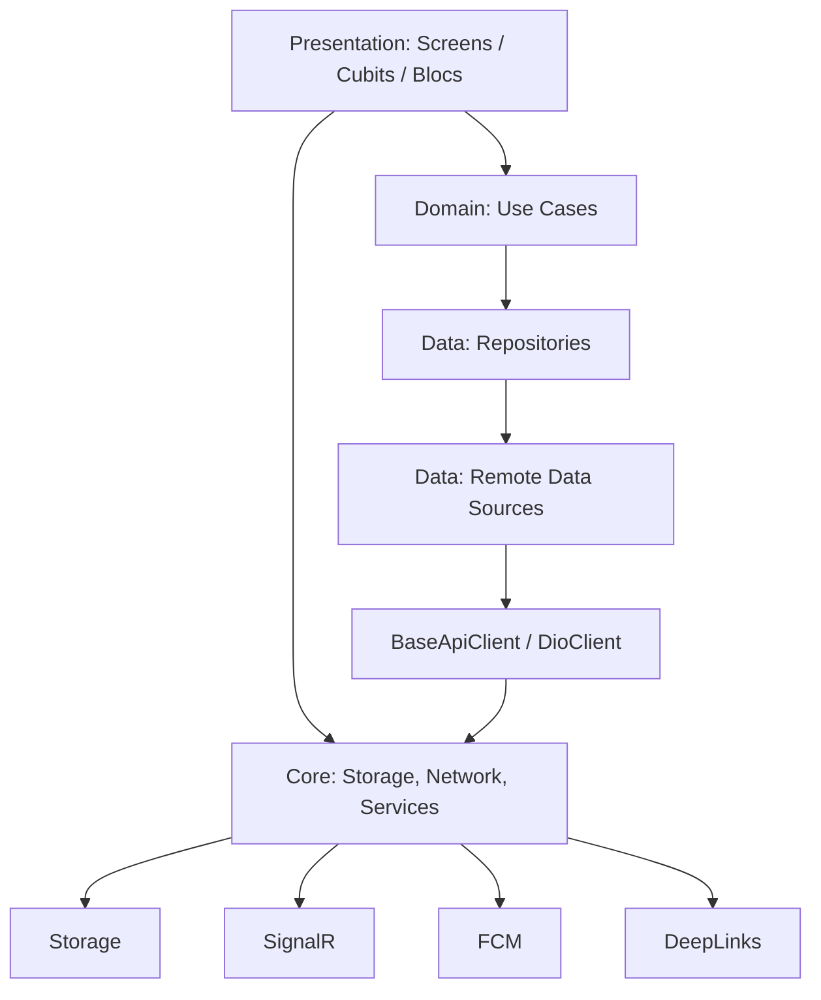

# Phase 1 — Architecture Audit

**Branch:** `refactor/enterprise-clean-architecture`  
**Date:** June 2026  
**Constraint:** Structural analysis only — no behavior changes in this document.

---

## 1. Executive summary

Vestie uses a **mature feature-first layout** with role-based top-level folders (`features/`, `user/`, `leader/`). Clean architecture layers (`data` / `domain` / `presentation`) are present in most API-backed modules. The main maintainability gaps are:

| Gap | Severity | Impact on onboarding |
|-----|----------|-------------------|
| Monolithic `ServiceLocator` (~520 lines) | High | Hard to find where dependencies register |
| Oversized navigation helper file (538 lines) | High | Project detail routing unclear |
| Role split (`user/` vs `leader/` vs `features/`) | Medium | New devs must learn three roots |
| Legacy files >400 lines (screens, cubits) | Medium | Long files slow comprehension |
| Naming: `*_helpers.dart`, duplicate repo names | Low | Ambiguous intent |
| No single FEATURE_MAP for API trace | Medium | API → UI path not documented in-repo |

**Verdict:** Architecture is sound for a production fintech app; refactor should **modularize cross-cutting files** and **document boundaries** before any mass folder migration.

---

## 2. Repository statistics

| Metric | Count |
|--------|-------|
| Dart files in `lib/` | ~794 |
| Shared `lib/features/` files | ~399 |
| `lib/user/features/` files | ~181 |
| `lib/leader/features/` files | ~51 |
| `lib/core/` + `lib/app/` | ~163 |
| Cubits / Blocs | ~48 |
| Repository implementations | ~22 domains |
| Test files | 32+ |
| Route constants (`AppRoutes`) | 80+ paths |

---

## 3. Current folder structure

```text
lib/
├── app/                    # MainApp, GoRouter, route groups, route args
├── bootstrap.dart          # Cold-start init
├── main.dart / main_dev.dart
├── core/
│   ├── auth/               # AppAuthSession, session sign-out
│   ├── bloc/               # Base form/pagination blocs
│   ├── constants/          # AppStrings, AppAssets, ApiConstants, AppDimens
│   ├── di/                 # ServiceLocator (single file)
│   ├── error/              # Failure, FailureMapper
│   ├── extensions/
│   ├── network/            # DioClient, BaseApiClient, interceptors
│   ├── realtime/           # SignalR services
│   ├── services/           # FCM, deep links, prefetch
│   ├── storage/
│   ├── stripe/
│   ├── theme/
│   ├── utils/
│   └── widgets/common/     # AppButton, AppTextField, shimmer, dialogs
├── features/               # Cross-role: auth, wallet, profile, project_detail, invites…
├── leader/features/        # create_project, leader project_detail moderation
└── user/features/          # home, discover, contribute, borrow, vff, investment
```

### 3.1 Feature boundaries (who owns what)

| Module | Location | Role |
|--------|----------|------|
| Auth, splash, onboarding | `features/auth`, `features/splash`, `features/onboarding` | All users |
| Dashboard shell | `features/dashboard` | All users |
| Wallet, KYC, bank, Stripe, payments | `features/wallet`, `kyc`, `bank_accounts`, `payment_methods`, `stripe` | All users |
| Project list, join, invites | `features/projects`, `features/invites` | All users |
| Project detail shell | `features/project_detail` | All users (UI branches by role) |
| Notifications | `features/notifications` | All users |
| Profile | `features/profile` | All users |
| Home, discover | `user/features/home`, `user/features/discover` | Members |
| Contribute, borrow | `user/features/contributions`, `user/features/borrow` | Members |
| VFF | `user/features/vff` | Members |
| Investment member UI | `user/features/investment`, `user/features/project_detail` | Members |
| Member fund storyboard | `user/features/create_project_member_fund` | UI-only walkthrough |
| Create project wizard | `leader/features/create_project` | Leaders |
| Leader moderation | `leader/features/project_detail` | Leaders / co-leaders |

---

## 4. Dependency graph (simplified)



### 4.1 ServiceLocator coupling

All repositories and use cases are **eager singletons** registered in `ServiceLocator.init()`. Presentation layers access them via:

- `ServiceLocator.instance.<useCase>`
- Factory methods: `createContributeBloc()`, `createProjectDetailBloc()`
- `MainApp` / route-level `BlocProvider` for tab-scoped cubits

**Risk:** Single file owns 20+ feature registrations — merge conflicts and slow onboarding.

### 4.2 API client usage

| Client | Used by |
|--------|---------|
| `DioClient` | Auth, borrow, project detail (legacy paths) |
| `BaseApiClient` | Wallet, VFF, notifications, project actions, contributions |

Both share `AuthInterceptor` on the underlying Dio instance.

---

## 5. State management map

| Pattern | Usage |
|---------|--------|
| **Cubit** | Form slices, tabs, wallet, profile, VFF hub, discover |
| **Bloc** | Auth submission, home list, contribute flow, project detail |
| **StatefulWidget** | Controllers, animation, scroll listeners only |

### Key cubit/bloc relationships

| Parent context | Child state | Notes |
|----------------|-------------|-------|
| `MainApp` | `CreateProjectCubit`, `WalletCubit`, `WalletTransactionCubit` | Survives wizard |
| `DashboardScreen` | `NavCubit` | Tab index |
| `HomeScreen` | `HomeBloc`, `HomeSectionsCubit` | Owned by screen state |
| `ProjectDetailScreen` | `ProjectDetailBloc` (per-route factory) | Fresh per open |
| `ContributeFlow` | `ContributeBloc` (factory) | Closed on pop |

---

## 6. Shared widget inventory

`lib/core/widgets/common/` (~60 widgets) — primary design system:

| Widget | Purpose |
|--------|---------|
| `AppButton`, `AppTextField`, `AppText` | Base UI |
| `AppSuccessScreen`, `AppErrorView` | Terminal / error states |
| `AppShimmer` | Loading skeletons (635 lines — candidate split) |
| `AppActionDialog`, `AppActionBottomSheet` | Confirmations |
| `PostAuthGradientBackground`, `PostAuthHeader` | Authenticated chrome |
| `LeaderActionMenu`, `MemberProjectActionMenu` | Role menus |
| `AppInviteMembersBottomSheet` | Invite flow |

**Duplication risk:** Empty states exist as `HomeEmptyView`, `UserVffHubEmptyBody`, `PaymentEmptyView` — similar layout, different copy/assets (acceptable; optional unify behind `AppEmptyState` config).

---

## 7. Navigation architecture

| File | Responsibility |
|------|----------------|
| `app_routes.dart` | Path constants (canonical) |
| `app_router.dart` | GoRouter assembly |
| `route_groups/*.dart` | Route tables by domain |
| `route_args/*.dart` | Typed `extra` payloads |
| `open_project_from_card.dart` | Home/discover → detail/join success |
| `project_detail_navigation_helpers.dart` | Detail sub-routes (538 lines — rename + split) |
| `project_invite_navigation.dart` | Post-auth invite routing |

**No raw path strings** in product UI — enforced by `AppRoutes` rule in `.cursor/rules/pre_commit.mdc`.

---

## 8. Files exceeding size guidelines

| File | Lines | Guideline | Action |
|------|-------|-----------|--------|
| `app_strings.dart` | 1272 | N/A (generated-style constants) | Keep; optional split by domain later |
| `app_shimmer.dart` | 635 | Widget 200 | Split by shimmer type |
| `project_detail_navigation_helpers.dart` | 538 | — | Rename + split by route group |
| `contribute_flow_screen.dart` | 489 | Screen 400 | Extract step bodies |
| `member_detail_screen.dart` | 482 | Screen 400 | Already partial widgets; extract scaffold |
| `service_locator.dart` | 476 | Service 300 | **Split inject_* modules** |
| `borrow_flow_screen.dart` | 470 | Screen 400 | Extract step widgets |
| `member_detail_cubit.dart` | 434 | Cubit 300 | Split action handlers |
| `project_routes.dart` | 415 | — | Document sections |

---

## 9. Naming audit (Phase 2 input)

### Compliant patterns (majority)

- Screens: `*_screen.dart` ✓
- Cubits: `*_cubit.dart` + `*_state.dart` ✓
- Repositories: `*_repository.dart` / `*_repository_impl.dart` ✓

### Ambiguous / improve

| Current | Issue | Target |
|---------|-------|--------|
| `project_detail_navigation_helpers.dart` | Vague “helpers” | `project_detail_navigation.dart` (+ splits) |
| `app_permission_helper.dart` | Generic helper | `app_permission_service.dart` (future) |
| `contributions_repository` vs `contribution_repository` | Duplicate naming | Document canonical; merge later |
| `formatters.dart` | Generic | `currency_formatters.dart` (future) |

### Not found (good)

No `screen1.dart`, `temp.dart`, `manager.dart`, `common.dart` (as filenames).

---

## 10. API vs UI-only modules

| Live API | UI-only / partial |
|----------|-------------------|
| Auth, wallet, contribute, borrow, join, invites, VFF, notifications | `create_project_member_fund` storyboard |
| Project detail (GET), project actions | Some investment snapshot screens |
| Stripe, KYC, bank | `userFlow` card mock shortcuts |

---

## 11. Phase 1 validation

- [x] Folder structure documented
- [x] Feature boundaries mapped
- [x] Dependency graph documented
- [x] Cubit/bloc relationships summarized
- [x] Repository layer inventoried
- [x] API client usage documented
- [x] Shared widgets catalogued
- [x] Oversized files identified
- [x] No production code modified in Phase 1

See [refactoring_roadmap.md](refactoring_roadmap.md) for phased execution plan.
