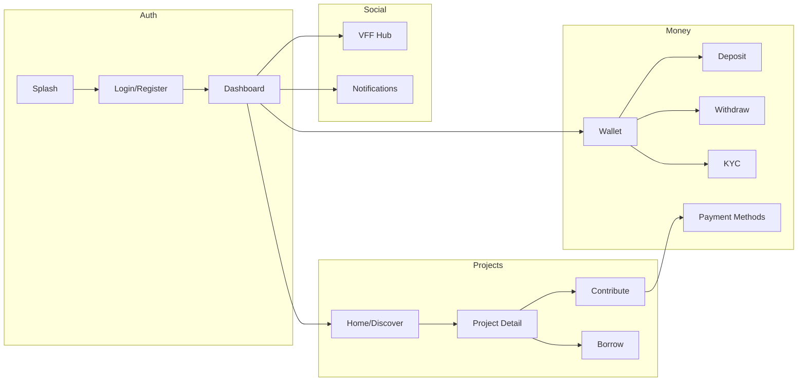

# Vestie — Project Flow Map

Step-by-step traces for the eight primary user journeys. Use with [`ARCHITECTURE_OVERVIEW.md`](ARCHITECTURE_OVERVIEW.md) and [`FEATURE_MAP.md`](FEATURE_MAP.md).

**Convention:** `UI → Cubit/Bloc → UseCase → Repository → API`

---

## 1. Authentication flow

### Cold start

```text
main() → bootstrap → SplashScreen (/)
  SplashCubit reads AppAuthSession + OnboardingPrefs + pending invite
    ├─ pending invite + authed → /join/:code
    ├─ authed + disclaimer OK → /dashboard
    ├─ authed + no disclaimer → /agreement
    ├─ not authed + onboarding done → /login
    └─ first launch → /onboarding → /login
```

### Login / register

| Step | UI | State | API |
|------|-----|-------|-----|
| Login | `LoginScreen` | `LoginBloc` | `POST /auth/login` |
| Register | `RegisterScreen` | `RegisterBloc` | `POST /auth/register` |
| Verify email | `VerifyEmailScreen` | `VerifyEmailCubit` | `POST /auth/verify` |
| Forgot / reset | `ForgotPasswordScreen`, `ResetPasswordScreen` | respective blocs | `/auth/forgot`, `/auth/reset` |

**Trace:** `LoginScreen` → `LoginBloc` → `LoginUseCase` → `AuthRepository` → `AuthRemoteDataSource`

### Post-auth routing

```text
Verify success → ProjectInviteNavigation.goAfterAuth
  ├─ disclaimer not accepted → /agreement (invite preserved)
  ├─ disclaimer OK + pending invite → /join/:code
  └─ disclaimer OK, no invite → /dashboard
```

**Agreement:** `AgreementScreen` → `AcceptRiskDisclaimerUseCase` → `GET/POST /users/me/risk-disclaimer`

**Session:** Token in `flutter_secure_storage`; `AppAuthSession` notifies GoRouter on change.

**Code:** `lib/features/auth/`, `lib/features/splash/`, `lib/features/onboarding/`

---

## 2. Wallet flow

### View wallet (tab 3)

```text
Dashboard → WalletScreen
  WalletCubit.load()
    → GetWalletUseCase
    → WalletRepository
    → GET /wallet
```

**Realtime:** `WalletSignalRService` (`/hubs/wallet`) can push balance updates; cubit reconciles with cache (`WalletBalanceCache`).

### Deposit

```text
WalletScreen → Deposit amount → DepositScreen
  DepositCubit
    → CreateDepositIntentUseCase → POST deposit intent
    → StripePaymentService.presentPaymentSheet()
  Success → refresh wallet cubit + ledger
```

### Withdraw

```text
WalletScreen → WithdrawScreen
  WithdrawCubit
    → PreviewWithdrawUseCase → GET withdraw preview
    → ConfirmWithdrawUseCase → POST withdraw
  Requires linked bank (bank_accounts feature) + KYC gate when applicable
```

**Prefetch:** `payment_methods_prefetch.dart`, `bank_accounts_prefetch.dart` warm caches on tab focus.

**Code:** `lib/features/wallet/`, `lib/core/stripe/`, `lib/core/realtime/wallet_signalr_service.dart`

---

## 3. Project flow (member join → detail)

### Discover / Home join

```text
HomeScreen / DiscoverScreen
  HomeBloc / DiscoverCubit → GET /projects?scope=mine|discover
  Cards show Total Members (list memberCount; owner-only API 0 → 1)
  Empty first Home: ShowcaseView on tabs + VFF (existing groups skip)
  User taps Join
    → JoinProjectUseCase → POST /projects/join { projectId }
    ├─ public + active → openProjectDetailAfterJoinSuccess
    └─ private pending → ProjectJoinRequestSentSuccess
```

### Invite link join

```text
/join/:inviteCode → ProjectInvitationScreen
  Invite preview API → POST /projects/join { inviteCode }
    ├─ public → ProjectJoinedSuccess → detail
    └─ private pending → RequestSent → dashboard
```

Deep links: `ProjectInviteDeepLinkService` (`https://…/join/{code}`, `vestie://join/{code}`).

### Project detail

```text
openProjectFromCard / openProjectDetailById
  → /project/detail OR /project/investment-detail
  ProjectDetailBloc → GET /projects/{id}
  Info card + View All + Group Members: Total Members N (owner-only empty roster → 1)
  ProjectDetailNavigation — push contribute, borrow, members, funds history
```

**Realtime:** `ProjectsSignalRService` for pot/member updates on detail scope.

**Code:** `lib/features/projects/`, `lib/features/invites/`, `lib/features/project_detail/`, `lib/user/features/home/`, `lib/user/features/discover/`

---

## 4. Leader flow (create & moderate)

### Create project

```text
Dashboard + tab → CreateProjectFlow
  CreateProjectCubit (survives wizard via MainApp provider)
    amount → details → settings branch (borrowing / investment / saving)
    → review → POST /projects + POST /projects/{id}/launch
    → /create-project/success → dashboard + push detail
```

**Trace:** `CreateProjectReviewScreen` → `CreateProjectCubit` → `CreateProjectUseCase` / `LaunchProjectUseCase`

### Moderation from detail

| Action | Route | API area |
|--------|-------|----------|
| Join requests | `/join-requests` | pending memberships approve/reject |
| Borrow requests | borrow screens | borrow-requests APIs |
| Announcements | `/create-announcement` | project announcements |
| Mark successful | `/mark-project-successful` | voting APIs |
| Cancel / stop contributions | leader routes | project actions |
| Distribute funds (investment) | leader investment distribution | distribution APIs |

**Handler:** `ProjectDetailNavigation.handleLeaderAction` — permission gates via `ProjectDetailEntity` flags.

**Code:** `lib/leader/features/create_project/`, `lib/leader/features/project_detail/`

---

## 5. Member flow (contribute, borrow, vote)

### Contribute

```text
Project detail → ContributeFlowScreen (/project/contribute)
  ContributeBloc
    → payment method selection (wallet / card)
    → ConfirmContributionUseCase → POST /projects/{id}/contributions
  Success → ProjectDetailNavigation.refreshAfterContribution
         → HomeProjectListSync.recordContribution
```

### Borrow (vacation / emergency only)

```text
Project detail → Borrow flow (/project/borrow)
  BorrowBloc / cubits
    → create borrow request → leader approval queue
    → repay flows under user/features/borrow/
```

### Success vote (vacation / emergency)

```text
Member vote UI → user/features/project_detail/
  UserSuccessVoteScreen, vote outcome screens
  VotingBloc → vote APIs (when wired to live backend)
```

**Code:** `lib/user/features/contribute/`, `lib/user/features/contributions/`, `lib/user/features/borrow/`, `lib/user/features/project_detail/`

---

## 6. VFF flow (Vestie Friends & Family)

```text
Home/Discover header → /user/vff (UserVffScreen)
  VffCubit / related cubits
    → GET /users/me/vffs, inbox, send request
  Send from project member row:
    ProjectDetailNavigation.sendVffRequestFromMemberRow
  Invite members dialog excludes existing VFF via InviteMembersMapper
```

Join-from-VFF paths may chain into `POST /projects/join` after social connection.

**Code:** `lib/user/features/vff/`

---

## 7. Payment flow (cards & Stripe)

### Add / manage payment methods

```text
Profile → PaymentMethodsScreen
  PaymentMethodsCubit
    → ListPaymentMethodsUseCase
    → AddPaymentMethodUseCase (Stripe SetupIntent + PaymentSheet)
```

### Contribute with card

```text
ContributePaymentPickerScreen
  → Stripe PaymentSheet via ContributeBloc + StripePaymentService
  → contribution API on success
```

### Stripe Connect / config

```text
features/stripe/ — fetches Stripe publishable key / Connect config from backend
core/stripe/stripe_payment_service.dart — SDK wrapper
```

**Code:** `lib/features/payment_methods/`, `lib/features/stripe/`, `lib/core/stripe/`

---

## 8. KYC flow

```text
Wallet or withdraw gate → Kyc onboarding prompt
  KycCubit
    → CreateKycSessionUseCase → POST /kyc/session
    → StripeBrowserOnboardingScreen (hosted Identity)
  Return: vestie://kyc/complete or vestie://kyc/refresh (app_links, not GoRouter)
  KycReturnUrlOutcome → refresh KYC status → unblock withdraw
```

Bank link (withdraw prerequisite) mirrors pattern with `vestie://bank/*` returns.

**Code:** `lib/features/kyc/`, `lib/features/bank_accounts/`, `lib/core/widgets/common/stripe_browser_onboarding_screen.dart`

---

## 9. Cross-cutting: Notifications

```text
FCM token sync (FcmPushService) + in-app list
NotificationsScreen → NotificationsCubit → GET notifications
Header bell from Home/Discover → /notifications

Push tap (foreground local / background / terminated) →
  FcmPushService._onNotificationTapped (or local-notification tap payload)
    → PushNotificationPayload.fromData
    → PushNotificationRouter.handleTap
        → (queued until splash leaves `/` and session is authenticated)
        → VffRequestReceived: push /user/vff Requests on top of Home
        → auth check
        → ProjectCreated: GET /projects/{id} → openProjectDetailById
        → VffRequestReceived: /user/vff Requests tab
        → JoinRequest: GET /projects/{id} → /project/join-requests (all categories)
        → WithdrawalFailed / deposit: Wallet tab
        → unknown: Home tab
```

**Code:** `lib/features/notifications/`, `lib/core/services/fcm_push_service.dart`, `lib/core/services/notifications/push_notification_router.dart`

**Details:** [`DOCS/push_notification_routing.md`](DOCS/push_notification_routing.md)

---

## 10. Quick reference diagram



---

## 11. When flows intersect

| Junction | Behavior |
|----------|----------|
| Contribute success | Updates project detail bloc + home list sync |
| Member profile pop | `refreshProjectDetailAfterMemberFlow` reloads detail |
| Invite after auth | `ProjectInviteRouteGuard` preserves code through agreement |
| Wallet balance | Cached for project borrow UI via `walletArgs()` |
| Investment distribution | `popAfterFundsDistributed` restores detail without full shimmer reload |

Full join-path detail: [`DOCS/architecture_flows.md`](DOCS/architecture_flows.md) §6–9.
