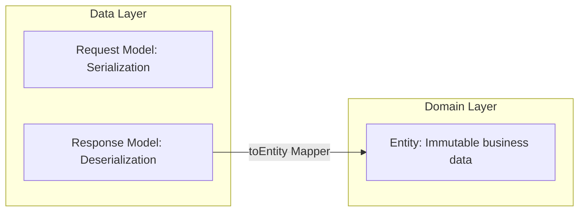

# 🤖 Cursor Agent Instruction Manual: End-to-End API Integration

Hello, Cursor Agent! This document is your dedicated instruction manual for maintaining, extending, and integrating REST APIs inside the **Vestie** Flutter codebase. 

The project strictly follows **Clean Architecture** paired with the **BLoC State Management Pattern**. Always read and conform to these guidelines before making any changes.

---

## 🗺️ 1. Architecture Directory Map

Ensure any code you generate lives in its respective Clean Architecture layer:

```
lib/
├── app/
│   └── router/                     # Router composition (split into modular route groups)
├── core/
│   ├── constants/
│   │   └── api_constants.dart      # CENTRALIZED endpoint strings (NEVER use raw strings!)
│   └── network/
│       └── base_api_client.dart    # Central Dio network client with interceptors
└── features/
    └── <feature_name>/
        ├── data/
        │   ├── datasources/        # REST API Remote Data Sources
        │   ├── models/             # JSON serializable request/response models
        │   └── repositories/       # Data Repository implementations (implements domain contracts)
        ├── domain/
        │   ├── entities/           # Pure, immutable business models (extends Equatable)
        │   ├── repositories/       # Domain repository contracts/interfaces
        │   └── usecases/           # Single-responsibility business use cases (extends UseCase)
        └── presentation/
            ├── bloc/               # Screen state management driven by type-safe BLoC events
            └── pages/              # Pixel-perfect UI screens listening and building from BLoC streams
```

---

## ⚙️ 2. The 7-Step API Integration Recipe

When tasked with integrating a new API endpoint, execute these **7 steps sequentially** to maintain consistency:

### Step 1: Centralize Endpoints in `ApiConstants`
Add the endpoint variable to [`lib/core/constants/api_constants.dart`](file:///c:/Users/hp/StudioProjects/Vestie/lib/core/constants/api_constants.dart):
```dart
static const String myNewAction = '/api/v1/feature/action';
```

### Step 2: Create Data Models
Create a model in `data/models/` handling `fromJson` and `toJson` serialization. Ensure all fields are typed safely, handling potential nulls gracefully using default fallbacks (`?? ''` or `?? 0.0`).

### Step 3: Implement Remote DataSource
Declare and implement the endpoint invocation inside `data/datasources/`:
```dart
abstract class MyRemoteDataSource {
  Future<MyResponseModel> executeAction({required String id});
}

class MyRemoteDataSourceImpl implements MyRemoteDataSource {
  final BaseApiClient apiClient;
  MyRemoteDataSourceImpl({required this.apiClient});

  @override
  Future<MyResponseModel> executeAction({required String id}) async {
    final response = await apiClient.post(ApiConstants.myNewAction, data: {'id': id});
    return MyResponseModel.fromJson(response.data);
  }
}
```

### Step 4: Define Repository Contract & Implementation
- **Domain Interface (`domain/repositories/`)**:
```dart
abstract class MyRepository {
  Future<Either<Failure, MyResponseEntity>> executeAction({required String id});
}
```
- **Data Implementation (`data/repositories/`)**:
```dart
class MyRepositoryImpl implements MyRepository {
  final MyRemoteDataSource remoteDataSource;
  MyRepositoryImpl({required this.remoteDataSource});

  @override
  Future<Either<Failure, MyResponseEntity>> executeAction({required String id}) async {
    try {
      final model = await remoteDataSource.executeAction(id: id);
      return Right(model.toEntity());
    } on Failure catch (f) {
      return Left(f);
    } catch (e) {
      return Left(ServerFailure(e.toString()));
    }
  }
}
```

### Step 5: Implement UseCase
Create a single-responsibility UseCase in `domain/usecases/` extending the core `UseCase` contract:
```dart
class ExecuteActionUseCase implements UseCase<MyResponseEntity, String> {
  final MyRepository repository;
  ExecuteActionUseCase({required this.repository});

  @override
  Future<Either<Failure, MyResponseEntity>> call(String params) {
    return repository.executeAction(id: params);
  }
}
```

### Step 6: Inject Dependencies in ServiceLocator
Open [`lib/core/di/service_locator.dart`](file:///c:/Users/hp/StudioProjects/Vestie/lib/core/di/service_locator.dart) and register the new classes:
```dart
sl.registerLazySingleton<MyRemoteDataSource>(() => MyRemoteDataSourceImpl(apiClient: sl()));
sl.registerLazySingleton<MyRepository>(() => MyRepositoryImpl(remoteDataSource: sl()));
sl.registerLazySingleton(() => ExecuteActionUseCase(repository: sl()));
```

### Step 7: Trigger State inside BLoC & Consume on UI
Add your UseCase to the presentation BLoC, map events to states, and wrap your presentation pages inside a `BlocBuilder` or `BlocListener`. **Never use raw state management (`setState`) in the presentation layer.**

---

## 📦 3. End-to-End Request & Response Model Patterns

To maintain a clean separation of concerns, always separate **Models** (Data Layer) from **Entities** (Domain Layer) using this exact pattern:



### 3.1 Creating Request Models (Data Layer)
Create request models inside `data/models/` to represent POST/PUT payloads. They only need `toJson()`:
```dart
class SubmitRequestModel {
  final String projectId;
  final double requestedAmount;
  final String reason;

  const SubmitRequestModel({
    required this.projectId,
    required this.requestedAmount,
    required this.reason,
  });

  Map<String, dynamic> toJson() => {
    'projectId': projectId,
    'requestedAmount': requestedAmount,
    'reason': reason,
  };
}
```

### 3.2 Creating Pure Domain Entities (Domain Layer)
Entities must be clean, immutable, reside in `domain/entities/`, and extend `Equatable`:
```dart
import 'package:equatable/equatable.dart';

class MyDetailsEntity extends Equatable {
  final String id;
  final double amount;
  final DateTime date;

  const MyDetailsEntity({
    required this.id,
    required this.amount,
    required this.date,
  });

  @override
  List<Object?> get props => [id, amount, date];
}
```

### 3.3 Creating Response Models with Safe Parsers & Mappers (Data Layer)
Response models in `data/models/` handle JSON decoding. Always parse fields **defensively** (handling potential nulls safely) and include a `.toEntity()` method:
```dart
import '../../domain/entities/my_details_entity.dart';

class MyDetailsResponseModel {
  final String id;
  final double amount;
  final String dateUtc;

  const MyDetailsResponseModel({
    required this.id,
    required this.amount,
    required this.dateUtc,
  });

  factory MyDetailsResponseModel.fromJson(Map<String, dynamic> json) {
    return MyDetailsResponseModel(
      id: json['id'] as String? ?? '',
      amount: (json['amount'] as num?)?.toDouble() ?? 0.0,
      dateUtc: json['dateUtc'] as String? ?? '',
    );
  }

  MyDetailsEntity toEntity() {
    return MyDetailsEntity(
      id: id,
      amount: amount,
      date: DateTime.tryParse(dateUtc) ?? DateTime.now(),
    );
  }
}
```

---

## 🔍 4. References & Reference Reading

Before starting any task, read these generated reference files for full integration context:
1. **[artifacts/api_integration_status_report.md](file:///C:/Users/hp/.gemini/antigravity/brain/884a6144-3b69-438c-94a3-92c98a0deb94/artifacts/api_integration_status_report.md)** — Contains screen-by-screen API mappings and QA functional test scenarios.
2. **[artifacts/api_integration_blueprint_for_llms.md](file:///C:/Users/hp/.gemini/antigravity/brain/884a6144-3b69-438c-94a3-92c98a0deb94/artifacts/api_integration_blueprint_for_llms.md)** — Paste-ready templates for data data sources and repositories.
3. **[artifacts/walkthrough.md](file:///C:/Users/hp/.gemini/antigravity/brain/884a6144-3b69-438c-94a3-92c98a0deb94/artifacts/walkthrough.md)** — Architectural summaries, role-based workflows, and execution checklists.

Let's maintain this high standard of codebase engineering!
